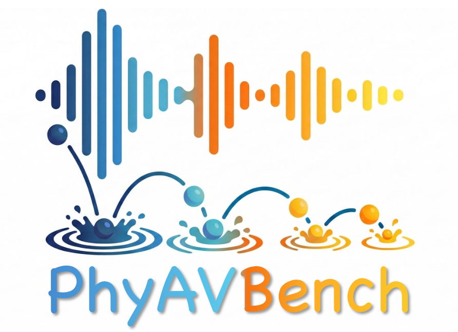
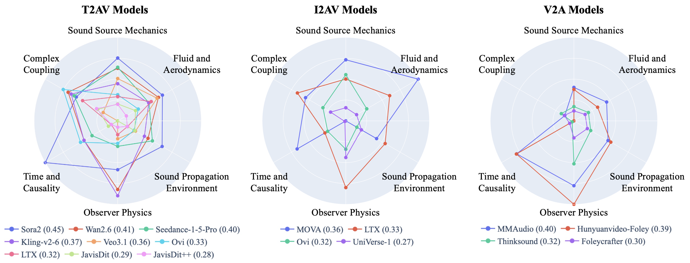

<h1 align="center">PhyAVBench</h1>

<p align="center">
  
</p>

<p align="center">
  <a href="https://arxiv.org/abs/2512.23994"></a>
  
</p>

PhyAVBench is the first benchmark for audio-physics grounding in T2AV/I2AV/V2A models, built on <strong>PhyAV-Sound-11K</strong> (11,605 videos, 25.5 hours, 184 participants). It includes 337 paired-prompt groups (avg. 17 videos/group), covering 6 dimensions and 41 test points, and evaluates 17 state-of-the-art models using Audio-Physics Sensitivity Test (APST) and Contrastive Physical Response Score (CPRS).

<p align="center">
  
</p>

## News

* **[2026-04-13]** We release 337 prompt groups (`src/phyavbench/data/prompt_all.jsonl`) along with their averaged ground-truth CLAP and ImageBind embeddings (`embeddings/gt_a2b`) used to compute CPRS scores, which are extracted from 11,605 newly recored audio samples.

## Setup

First, clone this repo and its submodules (CLAP and ImageBind):

```bash
git clone --recursive https://github.com/imxtx/PhyAVBench.git
```

Second, creat a virtual envrionment (e.g., conda) and install dependecies:


```bash
# Create and activate environment
conda create -n phyavbench python=3.12
conda activate phyavbench

# Install phyavbench
pip install .

# Install torch (CUDA 12.1)
pip install torch==2.5.1 torchvision==0.20.1 torchaudio==2.5.1 --index-url https://download.pytorch.org/whl/cu121

# Install CLAP dependency
pip install laion-clap

# Install ImageBind dependency
cd third_party/ImageBind
pip install .
pip install soundfile
cd ../..
```

In addition, make sure your machine has `ffmpeg` and `sox` installed:

```bash
# Using conda (recommended if you do not have root permissions)
conda install -c conda-forge ffmpeg
conda install -c conda-forge sox

# Alternatively, using apt or yum (requires root privileges; not recommended)
apt-get install ffmpeg sox
yum install ffmpeg sox
```

## Usage

### Data Preparation

Data preparation requires minimal effort: simply place all 337 groups of generated audible MP4 files in a folder and update the file path in the two provided scripts; the evaluation pipeline handles the rest. The results will be written into the `output` folder.


### Evaluation Scripts

Batch run script:

- `bash scripts/test_multiple_models.sh`

Pass `1` if you want to clean all audio and .npy files:

- `bash scripts/test_multiple_models.sh 1`

Single model run script:

- `bash scripts/test_single_model.sh`

### CLI

`test_multiple_models.sh` and `test_single_model.sh` use the following CLI commands to run the evaluation.

Show all commands:

```bash
phyavbench --help
```

Current commands:

- extract
- score
- batch-score
- clean

#### extract

Extract embeddings from either video input (audio extraction included) or audio input.

```bash
phyavbench extract --video-dir PATH [OPTIONS]
phyavbench extract --audio-dir PATH [OPTIONS]
```

Key options:

- --video-dir: directory containing mp4 files
- --audio-dir: directory containing wav/flac/mp3/m4a/ogg
- --audio-output-dir: default is sibling directory named audio
- --embedding-output-dir: default is sibling directory named audio_embedding
- --model: clap | imagebind | all
- --batch-size / -b: default 60

Behavior (incremental):

- With `--video-dir`, audio extraction is done per file stem; existing wav files are skipped.
- Embeddings are also done per file stem; existing `.npy` files are skipped.
- If all target embeddings for a selected model (e.g., CLAP, ImageBind) already exist, that model is not loaded.

Output structure:

```text
audio_embedding/
  clap/
    <sample>.npy
  imagebind/
    <sample>.npy
```

#### score

Compute CPRS from generated pairs and ground truth.

```bash
phyavbench score EMBEDDING_ROOT GROUND_TRUTH_ROOT [OPTIONS]
```

Notes:

- `EMBEDDING_ROOT` should contain clap and/or imagebind directories.
- Generated direction is computed from pair files: `<prompt>_a.npy` and `<prompt>_b.npy`.
- Ground truth is sectioned by model:
  - clap uses `GROUND_TRUTH_ROOT/clap`
  - imagebind uses `GROUND_TRUTH_ROOT/imagebind`
- Section selection is controlled by `--model` (`clap` | `imagebind` | `all`).
- Raw per-sample CSV is exported to `--output-dir`:
  - `clap_cprs_raw.csv` (when CLAP is scored)
  - `imagebind_cprs_raw.csv` (when ImageBind is scored)
- In raw CSV, the `model` column is inferred from `EMBEDDING_ROOT`:
  - if `EMBEDDING_ROOT` is `.../<model_name>/audio_embedding`, `model=<model_name>`
  - otherwise `model=<basename(EMBEDDING_ROOT)>`

Options:

- --output-dir: default `output`
- --report-name: default `cprs_result.md`
- --model: `clap` | `imagebind` | `all` (default: `all`)

#### batch-score

Run multi-model scoring.

```bash
phyavbench batch-score \
  --base-data-dir PATH \
  --gen-dirs model1 model2 ... \
  --ground-truth-embedding-dir PATH \
  --output-dir PATH \
  --report-name cprs_result.md \
  --model all # CLAP and ImageBind
```

Behavior:

- Audio extraction is incremental per file stem: existing wav files are skipped.
- Embedding extraction is incremental per file stem: existing `.npy` files are skipped.
- If all CLAP/ImageBind embeddings already exist for selected sections, the corresponding model is not loaded.
- Ground-truth embeddings are loaded once per section (CLAP/IMAGEBIND) and reused across all model directories.
- Final markdown report is split into two tables: CLAP and IMAGEBIND rankings.
- Raw per-sample CSV is exported:
  - `clap_cprs_raw.csv`
  - `imagebind_cprs_raw.csv`

Raw CSV columns:

```text
model,sample_id,cprs,cos,proj_coeff,proj_gauss,|proj_coeff-1|
```

#### clean

Delete generated artifacts for selected model directories.

```bash
phyavbench clean --base-data-dir PATH --gen-dirs model1 model2 ...
```

What is removed per model:

- audio/
- audio_embedding/
- cprs.md

Script note:

- `bash scripts/test_multiple_models.sh` and `bash scripts/test_single_model.sh` default to incremental mode (no clean).
- Pass `1` to clean first, then run full regeneration:
  - `bash scripts/test_multiple_models.sh 1`
  - `bash scripts/test_single_model.sh 1`

## Troubleshooting

ImageBind import error about pkg_resources:

```bash
pip install setuptools==81.0.0
```

OOM during extraction, just reduce the batch size:

```bash
phyavbench extract --audio-dir PATH --batch-size 16
```

Matched pairs unexpectedly low:

- Ensure generated files are named `<prompt>_a.npy` and `<prompt>_b.npy`.
- Ensure ground-truth files are named `<prompt>.npy` with the same prompt id.


## Citation

If you find this work helpful, please consider citing it:

```latex
@article{xie2025phyavbench,
  title={PhyAVBench: A Challenging Audio Physics-Sensitivity Benchmark for Physically Grounded Text-to-Audio-Video Generation},
  author={Xie, Tianxin and Lei, Wentao and Huang, Guanjie and Zhang, Pengfei and Jiang, Kai and Zhang, Chunhui and Ma, Fengji and He, Haoyu and Zhang, Han and He, Jiangshan and others},
  journal={arXiv preprint arXiv:2512.23994},
  year={2025}
}
```

If you have any questions, feel free to contact us at txie151[at]connect.hkust-gz.edu.cn.
